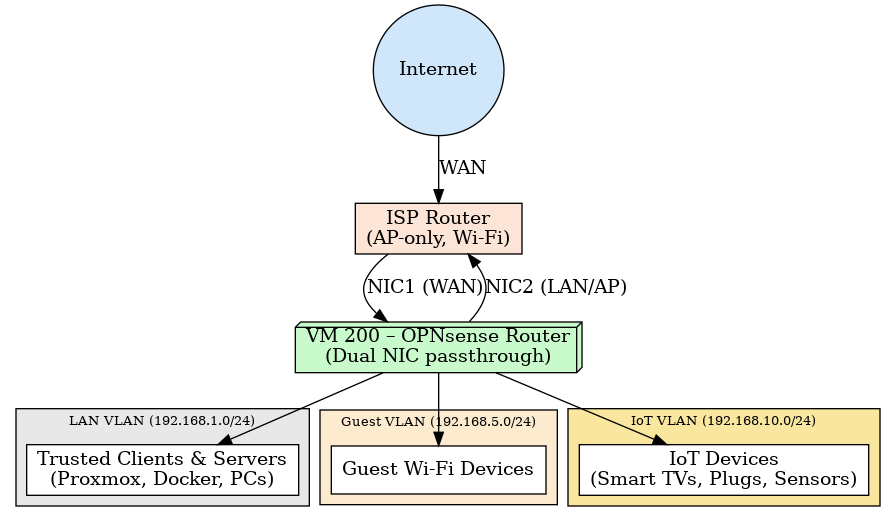
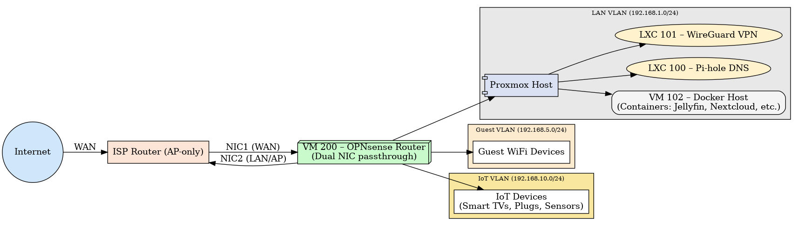

# 🏠 Homelab Projects – Ashil Muhammod Rafique  

Welcome 👋  
This repository documents my self-hosted **networking and security lab**, built on **Proxmox VE** with a mix of LXCs, VMs, and Dockerized services.  

My focus is on **Network Security Engineering** — combining **network design** (VLANs, VPNs, firewalls) with **secure service deployment**, **automation**, and **backup strategies**.  

---

## ⚙️ Core Infrastructure  

### 🖥️ Virtualization Platform  
- **Proxmox VE 8.4** on a Lenovo ThinkCentre M73.  
- **2 NICs** (built-in + USB Ethernet) passed through to virtual machines.  
- Infrastructure split logically:  
  - **LXCs** → lightweight DNS, VPN services.  
  - **VMs** → Firewall/router (OPNsense), Docker host.  

### 📦 Virtual Machines & Containers  
- **LXC 100 – Pi-hole** → DNS resolution + ad-blocking.  
- **LXC 101 – WireGuard VPN** → secure remote access (10.8.0.0/24).  
- **VM 200 – OPNsense Router** → virtualized firewall/router with dual NIC passthrough.  
- **VM 102 – Docker Host** → runs container stack (media, productivity, security, monitoring).  

### ⚡ Resource Management  
- Startup order: **DNS → VPN → Router → Applications**.  
- RAM locked per VM/LXC to prevent contention.  
- CPU pinning to balance load (e.g., Jellyfin transcoding isolated).  

---

## 🔐 Network Security Projects  

### 🛡️ Virtual Router with OPNsense  
I replaced my ISP router’s routing/firewall duties with an **OPNsense VM inside Proxmox**.  

**NIC Assignments:**  
- **NIC 1 (built-in Ethernet)** → WAN uplink to ISP router.  
- **NIC 2 (USB Ethernet)** → back into ISP router, used as **LAN/AP trunk**.  
- Both NICs are passed through to the OPNsense VM.  

🔹 **ISP Router (Vodafone PowerHub)** demoted to **Access Point mode**:  
- Provides Wi-Fi and LAN switching only.  
- DHCP and NAT disabled.  
- All routing and firewalling handled by **OPNsense**.  

### 🌐 VLAN Segmentation  
Implemented **VLAN separation** at the firewall level in OPNsense:  

- **192.168.1.0/24 – LAN VLAN**  
  - Trusted devices: Proxmox host, Docker stack, PCs.  
- **192.168.5.0/24 – Guest VLAN**  
  - Wi-Fi guests: internet-only, no lateral movement.  
- **192.168.10.0/24 – IoT VLAN**  
  - Smart TVs, plugs, sensors.  
  - Internet access restricted to firmware updates/cloud APIs.  
  - Manageable only from LAN VLAN.  

**Firewall Policy Highlights:**  
- Guest → Internet ✅ | Guest → LAN/IoT ❌  
- IoT → Internet (restricted) ✅ | IoT → LAN ❌ (except HA controls)  
- LAN → all VLANs ✅ (management, updates)  

### 🔑 WireGuard VPN + DDNS  
- **WireGuard LXC** provides secure remote access to LAN/IoT.  
- Clients join subnet **10.8.0.0/24**.  
- **Split tunneling** → only LAN + IoT routes over VPN.  
- **DDNS integration** → Proxmox updates WAN IP to DDNS provider after router reboots.  
- Strong cryptography: **ChaCha20** + **Curve25519** keys.  

---

## 🗄️ Application Stack (Docker Host – VM 102)  

### 🎬 Media & Library Management  
- **Jellyfin** → self-hosted media server.  
- **Radarr / Sonarr / Lidarr / Prowlarr** → library indexing + automated media organization.  
- **qBittorrentVPN** → containerized client routed through VPN for privacy.  

### 📂 Productivity & Storage  
- **Nextcloud** (+ MariaDB + Redis) → cloud storage, calendar, file sync.  
- **FreshRSS** → RSS aggregation (tech, security, news).  

### 💰 Finance & Budgeting  
- **Firefly III** → self-hosted finance manager.  
- **Firefly Importer** → automatic bank statement imports.  

### 🔐 Security & Management  
- **Vaultwarden** → Bitwarden-compatible password manager.  
- **Caddy** → reverse proxy, TLS termination (`*.docker.lan`).  
- **Portainer** → web UI for Docker management.  
- **Filebrowser** → web file explorer.  
- **Homepage** → unified dashboard.  

### ⚙️ Automation & Monitoring  
- **Home Assistant** → smart plug/humidity automation, notifications.  
- **Glances** → system & Docker monitoring API (used in Homepage).  

📂 Each container setup is documented in [`/docker`](./docker).  

---

## 💾 Backup & Disaster Recovery  

- **Proxmox vzdump** → VM/LXC snapshots.  
- **Restic** → encrypted, deduplicated backups of:  
  - `/etc/pihole/` (DNS configs)  
  - `/etc/wireguard/` (VPN configs)  
  - `/docker/configs/` (container configs)  
  - `/mnt/hdd` (media, Nextcloud, Firefly data)  
- **Rsync** → external HDD for large data sync.  

✅ Integrity Checks:  
- `restic check` runs weekly.  
- Monthly test restores validate backups.  

📂 Backup details in [`/backups/restic.md`](./backups/restic.md).  

---

## 🚀 Future Improvements  

### 🔒 Networking & Security  
- IDS/IPS (Suricata/Zeek) inside OPNsense.  
- pfBlockerNG for threat intelligence feeds.  
- Stricter IoT VLAN egress controls.  
- Deploy internal PKI for TLS certificates.  

### ⚙️ Infrastructure  
- Ansible/Terraform for automated provisioning.  
- Add second Proxmox node → HA cluster.  
- TrueNAS Scale with ZFS for storage resiliency.  
- Offsite cloud backups via restic + rclone.  

### 📊 Observability  
- Prometheus + Grafana dashboards.  
- Uptime Kuma for availability checks.  
- Centralized logging with ELK or Loki.  

---

## 🖼️ Homelab Architecture  

### 🔹 High-Level VLAN Topology  

### 🔹 Proxmox & Service Topology  

## 🎯 Career Focus  

- **Network Engineering** → VLANs, VPNs, routing, DDNS.  
- **Network Security** → segmentation, TLS everywhere, password mgmt.  
- **Infrastructure Engineering** → Proxmox, Docker orchestration, backups.  

---

## 📫 Connect with Me  

- 🔗 LinkedIn: www.linkedin.com/in/ashil-muhammod-rafique-56837a58
- 📧 Email: ashilrafique97@gmail.com

---

